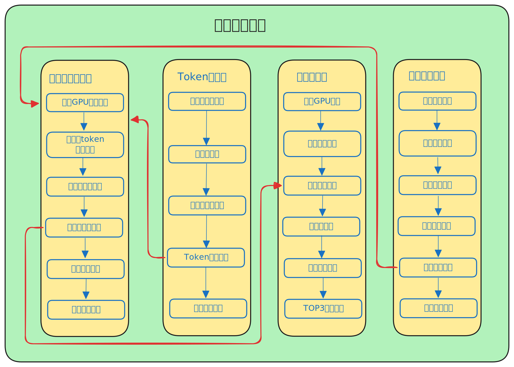

# 资源规划工具 (Resource Planning Tool)

一个基于Gradio的GPU资源规划与性能分析工具，帮助用户根据不同GPU型号、模型参数和输入长度，计算最优并发配置和硬件成本。

## 功能特点
- 📊 支持多种GPU型号(4090/910B1/A100/A800/H200等)和模型配置的性能数据查询
- ⚡ 计算不同硬件配置下的最大并发用户数和吞吐量
- 💰 生成成本优化方案，提供多维度性价比分析
- 📈 可视化展示性能趋势和最优配置推荐
- 🔄 实时数据刷新和交互式参数调整

## 总体流程



## 更新说明

- 2025-09-08 新增总体流程图与最大并发计算器核心逻辑流程图
- 2025-08-22 新增token计算 分词器可选功能
- 2025-08-21 新增在线接口并发测试
- 2025-08-20 新增评估工具下载及使用说明
- 2025-08-19 新增不同输出token长度推算功能
- 2025-08-18 新增用户自定义单用户吞吐量功能
- 2025-06-13 初始版本发布，支持基础的GPU性能计算、token测算和资源规划

- 后续计划: 
  - 基础测试数据更新（使用前缀缓存，更符合实际使用场景）
  - 性能测试工具后的结果数据文件添加至并发计算器路径下 可直接在并发计算器中使用
  - 新增模型部署、模型训练所需资源说明


## 项目结构
```shell
Resource_Planning_Tool/ 
├── data/ # 性能数据存储目录，按GPU型号和模型参数分类 
├── model/ # 分词器模型文件 
├── src/ # 核心功能模块 
│ ├── data_loader.py # 数据加载与解析 
│ ├── performance.py # 性能计算与优化 
│ ├── visualization.py # 结果可视化 
│ └── token_processor.py # 分词处理 
├── resourse_plan_tool.py # 主程序入口 
└── requirements.txt # 项目依赖
```

## 数据说明
性能数据存储在`data`目录下，按GPU型号(如4090/910B1)、模型大小(如7B/32B)和量化方式(如AWQ)分层组织，CSV文件包含不同并发配置下的性能指标。

## 部署环境 
- Python 3.10.12
- 安装依赖：`pip install -r requirements.txt`
- 运行脚本：`python resourse_plan_tool.py`

## 最大并发计算核心逻辑

