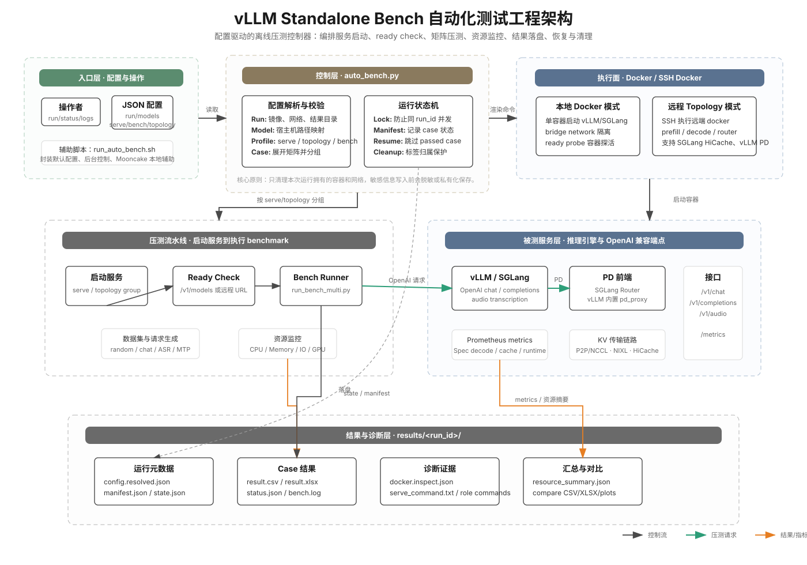

# vLLM Standalone Bench 自动化测试工程说明

本文面向需要维护、扩展或排查 `vllm_standalone_bench` 的开发者，解释这个自动化测试工程的架构、运行原理、核心模块和结果产物。快速启动命令和具体配置示例仍以 [README.md](README.md) 为主。



## 项目定位

`vllm_standalone_bench` 是一个离线友好的 LLM 推理服务自动化压测工程。它把服务启动、ready check、矩阵压测、资源监控、结果汇总、后台控制和失败诊断集中到一个配置驱动的控制器里，适合在单机 Docker、远程 SSH Docker、vLLM PD、SGLang PD 和 ASR 场景下重复执行可追踪的 benchmark。

它和直接运行 `vllm bench serve` 的主要差异是：

- **不要求主机安装 vLLM 包：** benchmark 逻辑和依赖封装在 `vllm-bench-runner:offline` 镜像中。
- **配置驱动：** 一个 JSON 配置同时描述运行目录、模型挂载、服务 profile、压测 profile 和远程 topology。
- **自动编排：** 控制器负责创建网络、启动服务、等待就绪、运行 benchmark、采集资源、保存诊断材料并清理资源。
- **可恢复：** `manifest.json` 中已通过的 case 会在 `resume` 时跳过，只补跑未完成或失败的 case。
- **面向对比：** 同一模型可按多个 serve/topology profile 与多个 bench profile 展开 case，用于对比 vLLM、SGLang、PD、HiCache、NIXL、P2P/NCCL 等组合。

## 目录结构

| 路径 | 作用 |
|---|---|
| `auto_bench.py` | 自动化压测控制器，负责配置解析、case 展开、服务编排、运行状态、恢复和清理。 |
| `run_auto_bench.sh` | 面向现场使用的启动脚本，封装默认配置、后台控制、日志查看和 Mooncake 辅助命令。 |
| `run_bench_multi.py` | 矩阵压测入口，把 input/output/concurrency/epoch 等组合展开为实际 benchmark。 |
| `run_bench_serve.py` | 独立的 serve benchmark 适配层，兼容 OpenAI Chat、Completions 和 Audio endpoint。 |
| `vllm_bench/serve.py` | 从 vLLM benchmark 逻辑抽取的指标计算与 runtime metrics 采样实现。 |
| `vllm_bench/pd_proxy.py` | vLLM PD 内置 proxy，负责 prefill/decode 请求编排和 KV 参数注入。 |
| `remote_topology.py` | 解析远程 PD topology，并渲染 prefill、decode、router 等角色的 Docker 命令。 |
| `remote_docker.py` | SSH Docker 执行器，支持 key/password auth，并对密码、token、API key 做脱敏。 |
| `resource_monitor.py` | 宿主机或远程主机资源采样与汇总，覆盖 CPU、内存、网络、磁盘和 NVIDIA GPU。 |
| `bench_compare.py` | 对多 profile 结果做对齐汇总，输出对比 CSV/XLSX 和图表。 |
| `configs/` | 自动化压测配置样例，覆盖 smoke、ASR、vLLM/SGLang 对比、PD、HiCache 等场景。 |
| `tests/` | 单元与集成测试，覆盖配置解析、命令渲染、指标提取、结果落盘、资源监控和 shell 脚本。 |
| `assets/` | 内置数据集和文档图表资源。 |

## 架构原理

整个工程按“入口配置 → 控制器 → 执行面 → 压测流水线 → 结果产物”分层。

1. **入口配置层**读取 JSON 配置和命令行参数。配置中的 `run`、`mounts`、`models`、`serve_profiles`、`topology_profiles`、`bench_profiles` 会被解析为类型化对象。
2. **控制层**由 `auto_bench.py` 承担。它校验本地路径，展开 `BenchmarkCase`，按服务 profile 或 topology profile 分组，并维护 `state.json`、`manifest.json` 和 `.run.lock`。
3. **执行面**分为本地 Docker 和远程 SSH Docker。普通 serve profile 在本地 Docker 中启动 vLLM 或 SGLang；topology profile 通过 SSH 在远端机器启动 prefill、decode 和 router 等角色。
4. **压测流水线**先启动服务，再执行 ready check，随后用 bench-runner 容器调用 `run_bench_multi.py`。每个 case 运行期间可启动资源监控，并把采样结果追加到 `result.csv` / `result.xlsx`。
5. **结果产物层**按 `results/<run_id>/<model>/<serve_or_topology>/<bench_profile>/` 组织。它保存 benchmark 结果、日志、状态、Docker inspect、命令快照和资源摘要，便于复现与排查。

## 配置模型

一个自动化压测配置通常包含以下部分：

| 配置段 | 说明 |
|---|---|
| `run` | 运行名、结果目录、镜像、Docker network、端口、API key、ready timeout、cooldown、资源监控配置。 |
| `mounts` | 宿主机模型目录和可选数据集目录，用于映射到容器内 `/models`、`/datasets`。 |
| `models` | 模型名称、容器内模型路径、tokenizer 路径和 OpenAI API 看到的 served model name。 |
| `serve_profiles` | 单容器推理服务 profile，例如 vLLM 或 SGLang 的镜像、GPU 和启动参数。 |
| `topology_profiles` | 多角色远程拓扑，例如 SGLang PD、vLLM PD P2P/NCCL、vLLM PD NIXL。 |
| `bench_profiles` | 压测矩阵，例如 backend、input/output length、parallel num、epoch、warmup、SLO 和数据集。 |

`auto_bench.py` 会把每个模型与每个服务维度、压测维度组合成 `BenchmarkCase`。普通 case 绑定 `serve_profile`，远程 PD case 绑定 `topology_profile`，两者互斥。

## 运行流程

### 普通 Docker 模式

1. 创建或复用配置中的 Docker bridge network。
2. 根据模型和 `serve_profile` 渲染服务容器命令。
3. 启动 vLLM 或 SGLang 容器，并按 Docker label 标记归属。
4. 用 ready probe 容器或主机端口检查 OpenAI endpoint 是否就绪。
5. 启动 bench-runner 容器，调用 `run_bench_multi.py` 发起压测。
6. 采集资源样本并合并到结果文件。
7. 保存服务日志、inspect、启动命令和 ready probe 诊断材料。
8. 清理本次运行拥有的 benchmark 容器、服务容器和可清理的 network。

### 远程 Topology 模式

远程模式由 `remote_topology.py` 和 `remote_docker.py` 配合完成：

1. 解析 `hosts`、`prefill`、`decode`、`frontend`、`sglang_hicache` 或 `vllm_pd` 配置。
2. 为每个角色渲染远程 Docker 命令，并对敏感参数生成脱敏版本。
3. 通过 SSH 在对应主机执行 Docker 命令。
4. 按角色顺序等待 prefill、decode、router 或 proxy 就绪。
5. 本地 bench-runner 直接压测 frontend endpoint。
6. 对远端角色采集资源监控，结束后拉取日志、inspect 和命令诊断文件。
7. 只清理带有本次 run label 且归属匹配的远程容器。

## Benchmark 与指标

`run_bench_multi.py` 负责把压测维度展开为实际调用，并把 `vllm_bench/serve.py` 返回的指标整理为行级结果。核心指标包括：

- **延迟：** TTFT、TPOT、ITL、E2EL 的平均值和分位数。
- **吞吐：** request throughput、output throughput、total token throughput。
- **质量约束：** Goodput SLO、最小吞吐、最小输出合规率。
- **输出合规：** 根据真实输出 token 数与请求输出长度计算 under-generation。
- **Runtime metrics：** 从 `/metrics` 采样 speculative decoding、KV cache、cache source、GPU cache usage 等指标。
- **ASR 指标：** 对 OpenAI Audio transcription 场景记录音频时长、RTFx 和语言参数。

`bench_compare.py` 可以在同一个 run 目录内对不同服务维度做对齐汇总，用于生成对比表和趋势图。

## 资源监控

`ResourceMonitor` 在每个 case 运行期间按固定间隔采样系统资源：

- `/proc/stat` 计算 CPU 利用率。
- `/proc/meminfo` 读取内存使用。
- `/proc/net/dev` 计算网络吞吐。
- `/proc/diskstats` 计算磁盘读写速率。
- `nvidia-smi` 采集 GPU 利用率、显存、功耗和温度。

普通 Docker 模式采集本机资源；远程 topology 模式可通过 `RemoteResourceReaders` 在每个远端角色所在主机采样。汇总结果会写入 `resource_samples.csv`、`resource_summary.json`，并追加到 benchmark 结果文件。

## 结果目录

一次运行的目录结构如下：

```text
vllm_standalone_bench/results/<run_id>/
├── .config.resume.json
├── config.resolved.json
├── controller.log
├── manifest.json
├── state.json
└── <model_name>/
    └── <serve_profile_or_topology_profile>/
        ├── vllm.log 或 topology role artifacts
        ├── docker.inspect.json
        ├── serve_command.txt
        └── <bench_profile>/
            ├── bench.log
            ├── result.csv
            ├── result.xlsx
            ├── resource_samples.csv
            ├── resource_summary.json
            └── status.json
```

`manifest.json` 是恢复逻辑的主索引。每条 case 记录包含模型、serve/topology profile、bench profile、状态以及相对结果路径。`state.json` 用于 `status` 命令展示当前进度、当前 case、完成数和终态。

## 后台控制与恢复

`auto_bench.py run --detach` 会启动后台控制器并写入运行状态。常用控制命令包括：

- `status`：读取 `state.json` 并展示当前进度。
- `logs`：优先跟随当前 case 的 `bench.log`，否则回退到 `controller.log`。
- `stop`：请求后台控制器优雅退出，并触发本次运行资源清理。
- `resume`：读取 `.config.resume.json` 和 `manifest.json`，只补跑未通过的 case。
- `cleanup`：按标签和归属关系清理本次 run 的残留资源。

为了避免重复控制器互相覆盖，运行目录中会维护 `.run.lock`。如果检测到同一 `run_id` 仍有活跃进程，新的 run/resume 会被拒绝。

## 安全与诊断设计

这个工程对现场排查做了几类保护：

- **归属标签：** 容器和网络带有 `vllm_auto_bench.*` 标签，清理时会检查 run、模型、profile 和角色，避免误删外部资源。
- **敏感信息脱敏：** SSH 密码、API key、secret、token 等参数在命令展示、日志或 inspect 保存前会被替换为 `***`。
- **原子写文件：** 关键 JSON 通过临时文件和 replace 写入，降低中断造成半文件的概率。
- **私有恢复配置：** `.config.resume.json` 以 0600 权限写入，减少敏感配置泄露面。
- **失败证据保留：** ready probe、服务容器、远程角色和 benchmark 都会尽量保存日志、inspect 和命令快照。

## 扩展指南

新增测试场景时，优先从配置扩展，而不是修改控制器：

1. **新增模型：** 在 `models` 中增加模型条目，并确保宿主机模型目录能映射到 `/models`。
2. **新增服务参数组合：** 增加 `serve_profiles`，把引擎参数放入 `args` 原样透传。
3. **新增压测矩阵：** 增加 `bench_profiles`，调整 backend、长度、并发、epoch、warmup 和 SLO。
4. **新增远程 PD 拓扑：** 增加 `topology_profiles`，补齐 hosts、prefill、decode、frontend 和引擎特定配置。
5. **新增数据集：** 对文本任务使用 `dataset_name` / `dataset_path`；对 ASR 任务使用 `openai-audio` backend 和 audio dataset。
6. **新增结果字段：** 优先在 `run_bench_multi.py` 中扩展行级结果，并在 `tests/test_result_csv_headers.py` 等测试中固定列契约。

需要新增执行后端或 topology 类型时，再进入 `remote_topology.py` 或 `auto_bench.py` 扩展命令渲染和 case 分组逻辑。

## 本地验证

文档和图表改动本身不需要启动 Docker。推荐至少运行：

```bash
python -m pytest -q vllm_standalone_bench/tests
python -m pytest -q vllm_standalone_bench/tests/test_auto_bench.py \
  vllm_standalone_bench/tests/test_remote_topology.py \
  vllm_standalone_bench/tests/test_resource_monitor.py
```

在受限沙盒中，涉及 socket、Docker 或远程 SSH 的测试可能因环境权限失败。遇到这类失败时，先确认是否在未改代码的基线也能复现，再判断是否属于本次改动引入。
